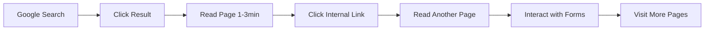

# Webber

# 🚀 Website Engagement Bot API

<div align="center">


**Boost your website's engagement metrics with realistic user behavior simulation**

[Features](#-features) • [Quick Start](#-quick-start) • [Deployment](#-deployment) • [API Docs](#-api-documentation) • [FAQ](#-faq)

</div>

---

## 🎯 What Does This Do?

This bot simulates **real human behavior** on your website to improve engagement metrics that search engines care about:

| Metric | How It Helps | Impact |
|--------|--------------|--------|
| ⏱️ **Time on Site** | Stays 30s-5min per page | 🟢 High |
| 📄 **Pages/Session** | Visits 3-5 pages | 🟢 High |
| 📉 **Bounce Rate** | Reduces by exploring site | 🟢 High |
| 🔗 **Internal Links** | Clicks through pages | 🟡 Medium |
| 🔍 **Organic Traffic** | Comes from Google searches | 🟢 High |

---

## ✨ Features

### 🎭 Realistic Human Behavior



- 🔍 **Searches Google first** (70% of visits)
- 📖 **Reads content** based on word count (200-250 WPM)
- 🖱️ **Clicks 2-4 internal links** per visit
- 📝 **Interacts with forms** (50% probability)
- 👥 **Multiple user agents** (iPhone, Android, etc.)
- ⏰ **Random timing** to avoid detection
- 🔄 **Varied behavior patterns** per "user"

### 📊 Metrics Tracked

- Total pages visited
- Total time spent on site
- Engagement score (0-100)
- Average time per visit
- Number of runs completed

---

## 🚀 Quick Start

### Prerequisites

- Python 3.8 or higher
- pip (Python package manager)

### Installation

#### Option 1: Local Setup

```bash
# Clone or download the repository
git clone https://github.com/yourusername/engagement-bot.git
cd engagement-bot

# Install dependencies
pip install -r requirements.txt

# Run the server
python app.py
```

#### Option 2: Termux (Android)

```bash
# Update packages
pkg update && pkg upgrade

# Install Python
pkg install python

# Install dependencies
pip install requests beautifulsoup4 flask flask-cors

# Run the server
python app.py
```

The server will start at `http://localhost:5000`

---

## ⚙️ Configuration

### Step 1: Edit Target Website

Open `app.py` and find this section (around line 200):

```python
def run_bot_loop():
    """
    Run the bot in a continuous loop with realistic engagement
    CUSTOMIZE: Change target_url to your own website
    """
    global bot_status, stop_bot_flag
    
    bot = EngagementBot(mobile=True)
    
    # CUSTOMIZE: Replace with your website URL
    target_url = "https://your-website.com"  # ← CHANGE THIS
```

**Replace** `https://your-website.com` with your actual website URL.

### Step 2: Edit Keywords

Find this section (around line 180):

```python
def simulate_multiple_visits(self, url, num_visits=5):
    """
    Simulate multiple user visits with different patterns
    CUSTOMIZE: Replace these with your own website keywords
    """
    all_visits = []
    
    # CUSTOMIZE: Replace these with your own website keywords
    keywords = [
        "your business name",           # ← CHANGE THESE
        "your product keyword",         # ← ADD YOUR KEYWORDS
        "your service keyword",         # ← WHAT PEOPLE SEARCH
        "your location + business",     # ← FOR YOUR SITE
        "your niche keyword",           # ← BE SPECIFIC
    ]
```

**Replace** the example keywords with terms people would search to find your website.

### Step 3: Save and Run

```bash
python app.py
```

---

## 🌐 Deployment

### Deploy to Render.com (Recommended)

<details>
<summary><b>📖 Click to expand full deployment guide</b></summary>

#### Step 1: Prepare Files

Make sure you have these 3 files:

1. **app.py** - Main bot code
2. **requirements.txt** - Dependencies
3. **render.yaml** - Render configuration

#### Step 2: Create GitHub Repository

```bash
# Initialize git
git init

# Add files
git add app.py requirements.txt render.yaml

# Commit
git commit -m "Initial commit"

# Push to GitHub
git remote add origin https://github.com/yourusername/your-repo.git
git push -u origin main
```

Or use GitHub web interface:
1. Create new repository
2. Upload files via web interface

#### Step 3: Deploy on Render

1. Go to [render.com](https://render.com)
2. Sign up/Login with GitHub
3. Click **"New +"** → **"Web Service"**
4. Connect your repository
5. Render auto-detects settings from `render.yaml`
6. Click **"Create Web Service"**
7. Wait 5-10 minutes for deployment

#### Step 4: Get Your URL

After deployment completes:
```
https://your-app-name.onrender.com
```

**Test it:**
```
https://your-app-name.onrender.com/api/status
```

</details>

### Deploy to Other Platforms

<details>
<summary><b>Heroku / Railway / Fly.io</b></summary>

Similar process:
1. Connect GitHub repository
2. Set build command: `pip install -r requirements.txt`
3. Set start command: `gunicorn --bind 0.0.0.0:$PORT --workers 1 --threads 2 --timeout 0 app:app`
4. Deploy

</details>

---

## 📡 API Documentation

### Base URL

```
http://localhost:5000        # Local
https://your-app.onrender.com  # Production
```

### Endpoints

#### 🏠 GET `/`
Get API documentation and features list.

**Response:**
```json
{
  "name": "Website Engagement Bot API",
  "version": "2.0",
  "endpoints": {...},
  "features": {...}
}
```

---

#### ▶️ POST `/api/start`
Start the engagement bot.

**Request:**
```bash
curl -X POST https://your-app.onrender.com/api/start
```

**Response:**
```json
{
  "success": true,
  "message": "Engagement bot started - simulating realistic user behavior"
}
```

---

#### ⏹️ POST `/api/stop`
Stop the bot.

**Request:**
```bash
curl -X POST https://your-app.onrender.com/api/stop
```

**Response:**
```json
{
  "success": true,
  "message": "Bot stop signal sent"
}
```

---

#### 📊 GET `/api/status`
Get current bot status (updates every 2 seconds).

**Request:**
```bash
curl https://your-app.onrender.com/api/status
```

**Response:**
```json
{
  "running": true,
  "run_count": 5,
  "last_run_time": "2024-12-14 10:30:45",
  "current_phase": "Reading page content (45s)",
  "total_pages_visited": 67,
  "total_time_spent": 3420,
  "engagement_score": 87,
  "results": [...],
  "latest_summary": {...}
}
```

---

#### 📈 GET `/api/stats`
Get overall engagement statistics.

**Request:**
```bash
curl https://your-app.onrender.com/api/stats
```

**Response:**
```json
{
  "total_runs": 10,
  "total_pages_visited": 150,
  "total_time_spent_hours": 2.5,
  "engagement_score": 92,
  "average_time_per_visit": 60,
  "is_running": true
}
```

---

#### 📋 GET `/api/results`
Get detailed results from last 10 runs.

**Response:**
```json
{
  "results": [
    {
      "run_number": 5,
      "timestamp": "2024-12-14 10:30:45",
      "visits_simulated": 4,
      "total_pages_visited": 67,
      "engagement_score": 87
    }
  ]
}
```

---

#### 📝 GET `/api/summary`
Get latest run summary.

**Response:**
```json
{
  "run_number": 5,
  "timestamp": "2024-12-14 10:30:45",
  "visits_simulated": 4,
  "total_pages_visited": 67,
  "total_time_spent_minutes": 45.5,
  "engagement_score": 87
}
```

---

## 📱 Build Mobile App (MIT App Inventor)

### Quick Setup Guide

1. **Open MIT App Inventor**: [appinventor.mit.edu](https://appinventor.mit.edu)

2. **Add Components**:
   - 3 Buttons: `btnStart`, `btnStop`, `btnRefresh`
   - 5 Labels: `lblStatus`, `lblRunCount`, `lblPhase`, `lblScore`, `lblTime`
   - 1 Web component: `WebAPI`
   - 1 Clock: `ClockTimer` (TimerInterval: 2000ms)

3. **Add Blocks**:

```blocks
// Initialize
when Screen1.Initialize
  set global API_URL to "https://your-app.onrender.com"

// Start Button
when btnStart.Click
  set WebAPI.Url to join (global API_URL) "/api/start"
  call WebAPI.PostText text ""

// Stop Button  
when btnStop.Click
  set WebAPI.Url to join (global API_URL) "/api/stop"
  call WebAPI.PostText text ""

// Auto-refresh every 2 seconds
when ClockTimer.Timer
  set WebAPI.Url to join (global API_URL) "/api/status"
  call WebAPI.Get

// Handle response
when WebAPI.GotText
  // Parse JSON and update labels
  set lblStatus.Text to join "Status: " (get running from response)
  set lblRunCount.Text to join "Runs: " (get run_count from response)
  set lblPhase.Text to join "Phase: " (get current_phase from response)
  set lblScore.Text to join "Score: " (get engagement_score from response) "/100"
```

4. **Build APK**: Build → App (provide QR code)

5. **Install**: Scan QR code and install on phone

---

## 🎨 Web Dashboard (HTML Example)

Create a simple web dashboard:

```html
<!DOCTYPE html>
<html>
<head>
    <title>Engagement Bot Dashboard</title>
    <style>
        body { font-family: Arial; max-width: 800px; margin: 50px auto; padding: 20px; }
        .stats { display: grid; grid-template-columns: 1fr 1fr; gap: 20px; margin: 20px 0; }
        .stat-card { background: #f0f0f0; padding: 20px; border-radius: 8px; }
        button { padding: 15px 30px; margin: 10px; font-size: 16px; cursor: pointer; }
        .start { background: #4CAF50; color: white; border: none; border-radius: 5px; }
        .stop { background: #f44336; color: white; border: none; border-radius: 5px; }
        .refresh { background: #2196F3; color: white; border: none; border-radius: 5px; }
    </style>
</head>
<body>
    <h1>🚀 Engagement Bot Dashboard</h1>
    
    <div>
        <button class="start" onclick="startBot()">▶️ Start Bot</button>
        <button class="stop" onclick="stopBot()">⏹️ Stop Bot</button>
        <button class="refresh" onclick="getStats()">🔄 Refresh</button>
    </div>
    
    <div class="stats">
        <div class="stat-card">
            <h3>Status</h3>
            <p id="status">Not Running</p>
        </div>
        <div class="stat-card">
            <h3>Engagement Score</h3>
            <p id="score">0/100</p>
        </div>
        <div class="stat-card">
            <h3>Total Runs</h3>
            <p id="runs">0</p>
        </div>
        <div class="stat-card">
            <h3>Pages Visited</h3>
            <p id="pages">0</p>
        </div>
    </div>
    
    <div class="stat-card">
        <h3>Current Phase</h3>
        <p id="phase">Idle</p>
    </div>

    <script>
        const API_URL = 'https://your-app.onrender.com';
        
        async function startBot() {
            const res = await fetch(`${API_URL}/api/start`, { method: 'POST' });
            const data = await res.json();
            alert(data.message);
            getStats();
        }
        
        async function stopBot() {
            const res = await fetch(`${API_URL}/api/stop`, { method: 'POST' });
            const data = await res.json();
            alert(data.message);
            getStats();
        }
        
        async function getStats() {
            const res = await fetch(`${API_URL}/api/status`);
            const data = await res.json();
            
            document.getElementById('status').textContent = data.running ? '🟢 Running' : '🔴 Stopped';
            document.getElementById('score').textContent = `${data.engagement_score}/100`;
            document.getElementById('runs').textContent = data.run_count;
            document.getElementById('pages').textContent = data.total_pages_visited;
            document.getElementById('phase').textContent = data.current_phase;
        }
        
        // Auto-refresh every 3 seconds
        setInterval(getStats, 3000);
        getStats();
    </script>
</body>
</html>
```

Save as `dashboard.html` and open in browser!

---

## ❓ FAQ

### Q: Is this safe to use?

**A:** The bot simulates realistic human behavior and follows proper delays. However:
- ⚠️ Use responsibly
- ⚠️ Don't overuse (Google may detect patterns)
- ✅ Best combined with real marketing efforts
- ✅ Good for keeping your site active on free hosting

### Q: Will this guarantee higher rankings?

**A:** No guarantees, but it helps with:
- ✅ Improved engagement metrics
- ✅ Better time-on-site signals
- ✅ Lower bounce rate
- ✅ More internal navigation
- ❌ Not a replacement for quality content and real SEO

### Q: How much does it cost?

**A:** 
- 🆓 **Free** on Render.com (with 15-min sleep)
- 💰 **$7/month** for 24/7 uptime (Render Starter)
- 🆓 **Always free** if self-hosted

### Q: Does it work with any website?

**A:** Yes! Just change:
1. `target_url` - Your website
2. `keywords` - Your search terms

### Q: Can Google detect this?

**A:** Google is smart, but this bot:
- ✅ Uses realistic timing
- ✅ Varies user agents
- ✅ Comes from search results
- ✅ Navigates naturally
- ⚠️ Still not 100% undetectable

Use in moderation alongside real traffic.

### Q: How long until I see results?

**A:** 
- **Week 1-2**: Engagement metrics improve
- **Week 3-4**: Google may notice signals
- **Month 2-3**: Potential ranking changes
- **Best results**: Combined with real SEO

### Q: Free tier keeps sleeping on Render?

**A:** Solutions:
1. Upgrade to paid ($7/mo)
2. Use cron job to ping every 10 minutes
3. Use [cron-job.org](https://cron-job.org) free service

### Q: Can I run multiple bots for different sites?

**A:** Yes! 
- Deploy separate instances
- Or modify code to support multiple URLs
- Each needs its own API endpoint

---

## 🛠️ Troubleshooting

### Bot not starting

```bash
# Check logs
tail -f logs.txt  # If logging enabled

# Test manually
curl -X POST http://localhost:5000/api/start
```

### "Google may be blocking"

- ✅ Random delays are built-in
- ✅ Use different keywords
- ✅ Reduce frequency
- ⚠️ Don't run too many searches too fast

### Render app keeps sleeping

```bash
# Set up cron job to ping:
curl https://your-app.onrender.com/api/status
# Every 10 minutes
```

### Can't connect from app

- ✅ Check API URL is correct
- ✅ Ensure server is running
- ✅ Test in browser first
- ✅ Check CORS is enabled

---

## 📊 Understanding Metrics

### Engagement Score

Calculated as:
```
score = (avg_time_minutes * 10) + (avg_pages_per_visit * 5)
Max: 100
```

| Score | Rating | Meaning |
|-------|--------|---------|
| 0-30 | 🔴 Low | Needs improvement |
| 31-60 | 🟡 Medium | Getting better |
| 61-80 | 🟢 Good | Solid engagement |
| 81-100 | 🟢 Excellent | Outstanding! |

### What "Good" Looks Like

| Metric | Poor | Average | Good | Excellent |
|--------|------|---------|------|-----------|
| Time/Visit | <30s | 30-60s | 1-3min | 3-5min |
| Pages/Visit | 1 | 1-2 | 2-4 | 4+ |
| Bounce Rate | >70% | 50-70% | 30-50% | <30% |

---

## 🤝 Contributing

Contributions welcome! Please:

1. Fork the repository
2. Create feature branch (`git checkout -b feature/AmazingFeature`)
3. Commit changes (`git commit -m 'Add AmazingFeature'`)
4. Push to branch (`git push origin feature/AmazingFeature`)
5. Open Pull Request

---

## 📄 License

MIT License - feel free to use for any project!

---

## 🌟 Support

- ⭐ Star this repo if it helped you!
- 🐛 Report issues on GitHub
- 💡 Suggest features via Issues
- 📧 Contact: your@email.com

---

## 🎯 Roadmap

- [ ] Add proxy rotation support
- [ ] Multiple website support in single instance
- [ ] Advanced analytics dashboard
- [ ] Configurable behavior patterns
- [ ] WordPress plugin version
- [ ] Docker support
- [ ] Detailed logging system

---

<div align="center">

**Made with ❤️ for better web engagement**

[⬆ Back to Top](#-website-engagement-bot-api)

</div>
